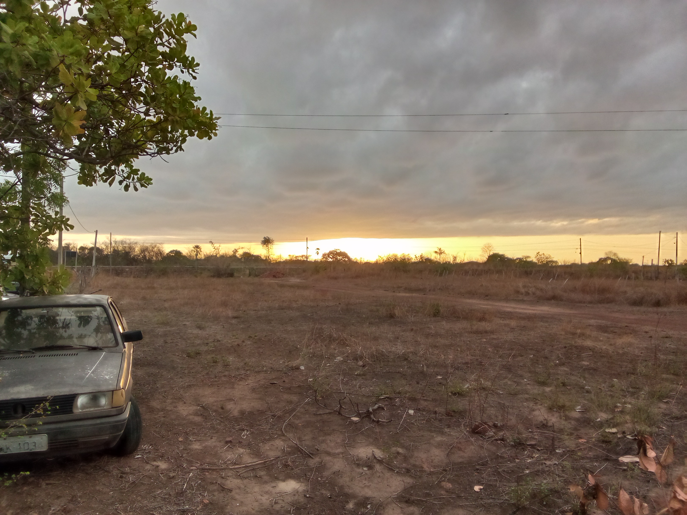

id: 1
data: 2026-07-11T14:35:18-03:00
tags: #article #anime #life #teste
# Como penso sobre arquitetura de software

> **Estado:** Em evolução  
> **Última revisão:** 11 de julho de 2026



## Introdução

Ao longo dos últimos anos percebi que arquiteturas não envelhecem mal por causa da tecnologia utilizada, mas sim pelas decisões tomadas durante sua construção.

Uma boa arquitetura não tenta prever o futuro. Ela tenta **facilitar mudanças**.

Esse artigo reúne algumas observações pessoais que venho refinando durante o desenvolvimento de diferentes projetos.

---

## Um projeto sempre muda

É comum iniciar um projeto imaginando que todos os requisitos já foram definidos.

Na prática, isso raramente acontece.

Os seguintes fatores costumam aparecer com o tempo:

- novos requisitos;
- mudanças no domínio;
- crescimento da equipe;
- integração com outros sistemas;
- limitações técnicas.

Por isso, procuro desenvolver sistemas assumindo que mudanças são inevitáveis.

---

## Algumas perguntas que costumo fazer

Antes de criar uma nova funcionalidade tento responder:

1. Qual problema estou resolvendo?
2. Esta abstração realmente reduz complexidade?
3. Estou criando dependências desnecessárias?
4. Essa decisão continuará fazendo sentido daqui a seis meses?
5. O código comunica claramente sua intenção?

Nem sempre encontro a resposta correta imediatamente.

---

## Exemplo de estrutura

```text
app/
├── api/
├── domain/
├── infrastructure/
├── services/
└── shared/
````

O importante não é exatamente esta organização.

O importante é que ela comunique claramente as responsabilidades de cada módulo.

---

## Um trecho de código

```python
class UserService:
    def create(self, user: UserCreate):
        ...
```

Evito criar abstrações apenas porque um livro recomenda.

Prefiro introduzir novas camadas quando existe uma necessidade concreta.

---

## Tecnologias utilizadas

|Tecnologia|Motivo|
|---|---|
|FastAPI|Desenvolvimento rápido de APIs|
|PostgreSQL|Banco relacional robusto|
|Docker|Ambiente reproduzível|
|Next.js|Interface moderna|
|Git|Controle de versão|

---

## Referências

Alguns materiais que considero úteis:

- Clean Architecture
    
- Domain-Driven Design
    
- Refactoring
    
- Designing Data-Intensive Applications
    

Também gosto de consultar documentação oficial sempre que possível.

---

## Links interessantes

- Documentação do FastAPI: [https://fastapi.tiangolo.com/](https://fastapi.tiangolo.com/)
    
- PostgreSQL: [https://www.postgresql.org/](https://www.postgresql.org/)
    
- MDN Web Docs: [https://developer.mozilla.org/](https://developer.mozilla.org/)
    

---

## Observações

> Nem toda abstração reduz complexidade.

Às vezes remover código é uma decisão melhor do que adicionar uma nova camada.

---

## Próximos estudos

-  Investigar arquitetura orientada a eventos.
    
-  Comparar monólitos modulares com microsserviços.
    
-  Estudar CQRS em projetos pequenos.
    
-  Escrever um artigo sobre organização de domínios.
    

---

## Projetos relacionados

- Plataforma Cuidar
    
- Equitas
    
- Estudos sobre compiladores
    

---
### Futuras revisões

Pretendo complementar este artigo conforme novos projetos tragam experiências diferentes.

---

## Conclusão

Hoje acredito que arquitetura de software está muito mais relacionada à comunicação do que à tecnologia.

Boas decisões tornam o código compreensível.

Código compreensível facilita mudanças.

E sistemas que aceitam mudanças tendem a sobreviver por muito mais tempo.