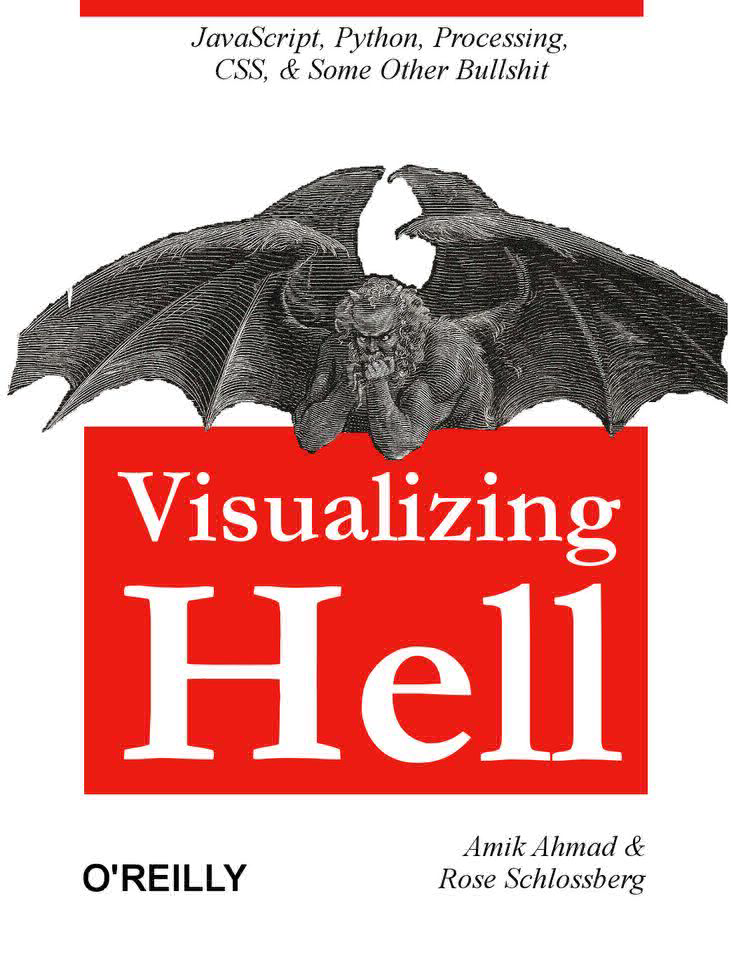

# A Arte da Leitura e Aprendizado Contínuo

---
id: 102
date: 2026-09-05
tags: #leitura #livros #produtividade
---

Livros são pontes para novos conhecimentos e expansão de horizontes. No desenvolvimento de software, a leitura constante de boas práticas, arquitetura e hábitos saudáveis de código nos torna profissionais melhores a cada dia.

## Por que ler diariamente?

1. **Expansão do repertório**: Compreender diferentes abordagens para resolução de problemas.
2. **Foco e concentração**: Redução de distrações e desenvolvimento de raciocínio profundo.
3. **Melhoria na comunicação**: Expressar ideias de forma clara em documentações e code reviews.

---
*Artigo de teste para upload de mídia no Blog Control.*
